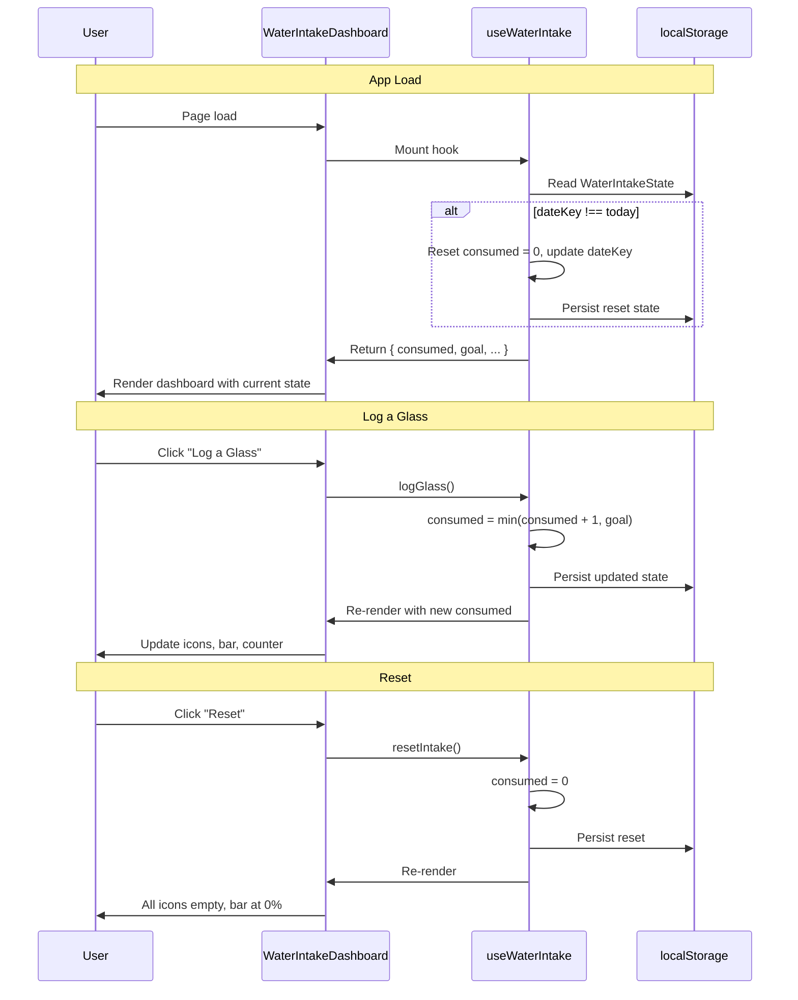

# 01 View Water Intake Dashboard - Implementation Plan

## User Story

As a user, I want to see a clear water intake counter on the app's landing page, so that I can immediately see my hydration progress for the day at a glance.

---

## Pre-conditions

- Next.js 15 App Router project with React 19 and TypeScript (strict mode)
- Tailwind CSS v4 with `@theme` directive configured in `globals.css`
- Design system tokens follow Palo IT brand palette (PALO Teal `#00ab9c` as primary)
- No existing water intake logic — `src/app/page.tsx` is the default Next.js placeholder
- No persistent backend; intake data is stored in `localStorage` and resets each day
- Default daily goal is **8 glasses**

---

## Design

### Visual Layout

The landing page is replaced entirely by the Water Intake Dashboard, which is the primary and only element on the page.

```
┌──────────────────────────────────────────────┐
│  Header: App title "Daily Hydration"          │
├──────────────────────────────────────────────┤
│                                              │
│   [Glass Icon × 8 grid]                      │
│   ●●●○○○○○  (filled = consumed)              │
│                                              │
│   "3 / 8 glasses"  (counter)                 │
│                                              │
│   [Progress Bar 37.5%]                       │
│                                              │
│   [+ Log a Glass]  (primary CTA button)      │
│                                              │
│   [↺ Reset]  (secondary ghost button)        │
│                                              │
└──────────────────────────────────────────────┘
```

**Key UI elements:**
- **Glass icon grid** — 8 icons, filled teal when consumed, muted when remaining
- **Counter text** — bold, prominent (e.g., "3 / 8 glasses")
- **Progress bar** — horizontal, teal fill from left to right
- **Log a Glass button** — primary CTA, disabled when goal reached
- **Reset button** — ghost style, resets today's count to 0

### Color and Typography

Following the project's Palo IT design system:

- **Background**: `bg-[var(--surface-secondary)]` (`#f8fafc`) for page; `bg-[var(--surface)]` (`#ffffff`) for card
- **Primary Brand**: `bg-[var(--primary)]` (`#00ab9c`) for progress bar fill and filled glass icons
- **Counter**: `text-[var(--text-primary)]` — `font-inter text-5xl font-bold`
- **Subtext / Label**: `text-[var(--text-secondary)]` — `text-base font-medium`
- **CTA Button**: `bg-[var(--primary)] hover:bg-[var(--primary-hover)] text-white` — `rounded-xl px-8 py-3 font-semibold`
- **Ghost Button**: `text-[var(--text-secondary)] hover:text-[var(--primary)]` — `text-sm font-medium`
- **Progress Bar Track**: `bg-[var(--color-teal-100)]`; Fill: `bg-[var(--primary)]`
- **Glass Icon (filled)**: `text-[var(--primary)]`
- **Glass Icon (empty)**: `text-[var(--color-gray-300)]`

### Interaction Patterns

- **Log a Glass button**:
  - Hover: brightness increase + scale 1.02 (150ms ease)
  - Click: scale down to 0.98, instant optimistic update to count and icons
  - Disabled state when `consumed >= goal`: muted background, `cursor-not-allowed`
  - Accessibility: `aria-label="Log a glass of water"` with keyboard focus ring

- **Glass icon grid**:
  - Each icon transitions from empty → filled with a brief scale + color animation when count increases
  - Transition: `transition-all duration-300 ease-out`

- **Progress bar**:
  - Smooth width transition: `transition-[width] duration-500 ease-out`

- **Reset button**:
  - Renders only when `consumed > 0`
  - Hover: color shifts to teal

### Measurements and Spacing

```
Page container:   max-w-md mx-auto px-4 py-12
Card:             rounded-2xl shadow-lg p-8 bg-[var(--surface)]
Glass grid:       grid grid-cols-4 gap-3 mb-6  (8 icons → 2 rows × 4 cols)
Glass icon:       w-12 h-12
Counter text:     text-5xl font-bold mb-1
Subtext:          text-base mb-6
Progress bar:     w-full h-3 rounded-full mb-8
CTA button:       w-full h-14 rounded-xl text-lg font-semibold mb-3
Reset button:     text-sm centered, mt-2
```

### Responsive Behavior

- **Mobile (< 640px)**:
  - Full-width card with `px-4` page padding
  - Glass grid: `grid-cols-4` (2 rows of 4 remains comfortable at small sizes)
  - Counter: `text-4xl`

- **Tablet / Desktop (≥ 640px)**:
  - Card constrained to `max-w-md` centered
  - Counter: `text-5xl`
  - Generous internal padding

---

## Technical Requirements

### Component Structure

```
src/
├── app/
│   ├── page.tsx                          # Landing page — Server Component (thin shell)
│   └── _components/
│       ├── WaterIntakeDashboard.tsx      # Client Component — main dashboard container
│       ├── GlassGrid.tsx                 # Client Component — 8 glass icons with fill state
│       ├── IntakeProgressBar.tsx         # Client Component — animated progress bar
│       └── useWaterIntake.ts             # Custom hook — state + localStorage logic
└── types/
    └── water-intake.ts                   # TypeScript interface definitions
```

### Required Components

- `WaterIntakeDashboard` ⬜ — Orchestrates all sub-components; receives no props (self-contained)
- `GlassGrid` ⬜ — Displays 8 glass icons; props: `consumed: number`, `goal: number`
- `IntakeProgressBar` ⬜ — Animated bar; props: `consumed: number`, `goal: number`
- `useWaterIntake` ⬜ — Custom hook managing count, daily reset, localStorage persistence

### State Management Requirements

```typescript
// src/types/water-intake.ts
interface WaterIntakeState {
  consumed: number;       // glasses consumed today
  goal: number;           // daily goal (default: 8)
  dateKey: string;        // ISO date string "YYYY-MM-DD" for daily reset detection
}

// Hook interface (src/app/_components/useWaterIntake.ts)
interface UseWaterIntakeReturn {
  consumed: number;
  goal: number;
  isGoalReached: boolean;
  progressPercent: number;
  logGlass: () => void;
  resetIntake: () => void;
}
```

**State logic:**
- On mount: read `WaterIntakeState` from `localStorage`
- If stored `dateKey !== today` → reset `consumed` to `0` and update `dateKey`
- `logGlass`: increment `consumed` by 1 (max: `goal`), persist to `localStorage`
- `resetIntake`: set `consumed` to `0`, persist to `localStorage`
- `progressPercent`: `Math.round((consumed / goal) * 100)`

---

## Acceptance Criteria

### Layout & Content

1. Landing Page
   ```
   - Full-page centered layout with light background
   - Single card as focal point, max-w-md, rounded-2xl, shadow
   - App title "Daily Hydration" as H1 at the top of the card
   - No other content or navigation — dashboard is the primary element
   ```

2. Glass Icon Grid
   ```
   - Exactly 8 icons displayed in a 4×2 grid
   - Filled icons count = consumed value
   - Empty icons count = goal - consumed
   - Smooth transition when an icon changes state
   ```

3. Counter and Progress Bar
   ```
   - Counter format: "{consumed} / {goal} glasses"
   - Progress bar width = (consumed / goal) × 100%
   - Both update synchronously on every log action
   ```

### Functionality

1. Logging a Glass

   - [ ] Clicking "Log a Glass" increments `consumed` by 1
   - [ ] One filled glass icon is added immediately (optimistic UI)
   - [ ] Progress bar and counter update synchronously
   - [ ] Button is disabled and visually muted when `consumed >= goal`
   - [ ] Persisted to `localStorage` immediately after each log

2. Daily Reset

   - [ ] On first app load of a new day, `consumed` resets to `0`
   - [ ] Reset is determined by comparing stored `dateKey` to today's ISO date
   - [ ] All visual indicators (icons, bar, counter) reflect the reset state

3. Manual Reset

   - [ ] "Reset" ghost button visible only when `consumed > 0`
   - [ ] Clicking reset sets `consumed` to `0` and updates all indicators
   - [ ] Reset button disappears after resetting

### Error Handling

- If `localStorage` is unavailable (e.g., private browsing fallback): initialise in-memory state only; do not throw
- If stored data is malformed or missing required fields: fallback to `{ consumed: 0, goal: 8, dateKey: today }`

---

## Modified Files

```
src/
├── app/
│   ├── page.tsx ⬜                          # Replace default content with dashboard
│   ├── globals.css ⬜                        # Add Palo IT design tokens (@theme)
│   └── _components/
│       ├── WaterIntakeDashboard.tsx ⬜
│       ├── GlassGrid.tsx ⬜
│       ├── IntakeProgressBar.tsx ⬜
│       └── useWaterIntake.ts ⬜
└── types/
    └── water-intake.ts ⬜
```

---

## Status

⬜ NOT STARTED

1. Setup & Configuration

   - [ ] Add Palo IT design tokens (teal scale, semantic tokens) to `globals.css` via `@theme`
   - [ ] Create `src/types/water-intake.ts` with `WaterIntakeState` and `UseWaterIntakeReturn`

2. Core Hook

   - [ ] Implement `useWaterIntake.ts` with localStorage read/write, daily reset logic
   - [ ] Handle `localStorage` unavailability gracefully

3. Component Implementation

   - [ ] Implement `IntakeProgressBar.tsx` — animated width transition
   - [ ] Implement `GlassGrid.tsx` — 8 icons, filled/empty states with transition
   - [ ] Implement `WaterIntakeDashboard.tsx` — compose sub-components, CTA and reset buttons
   - [ ] Update `src/app/page.tsx` — replace placeholder with `<WaterIntakeDashboard />`

4. Styling & Polish

   - [ ] Apply Palo IT color tokens throughout all components
   - [ ] Verify responsive layout on mobile (`< 640px`) and desktop
   - [ ] Add `transition` and animation classes to glass icons and progress bar
   - [ ] Ensure disabled state for CTA button at goal reached

5. Testing

   - [ ] Hook: daily reset triggers when `dateKey` differs from today
   - [ ] Hook: `logGlass` does not exceed `goal`
   - [ ] Hook: graceful `localStorage` failure fallback
   - [ ] Component: `GlassGrid` renders exactly `goal` icons with correct filled count
   - [ ] Component: `IntakeProgressBar` renders correct width percentage
   - [ ] Component: CTA button disabled when goal reached
   - [ ] Integration: full flow — log 8 glasses, verify goal-reached state

---

## Dependencies

- No new `npm` packages required — uses built-in React hooks (`useState`, `useEffect`, `useCallback`) and browser `localStorage`
- Lucide React (optional, already in tech stack): `GlassWater` icon for the glass grid

---

## Related Stories

- Story 2 — Goal customisation (set daily goal other than 8 glasses)

---

## Notes

### Technical Considerations

1. **Server vs Client boundary**: `page.tsx` remains a Server Component; `WaterIntakeDashboard` is a `'use client'` component to access `localStorage` and manage state
2. **Daily reset key**: Use `new Date().toISOString().split('T')[0]` (e.g., `"2026-03-20"`) as the `dateKey` — timezone is user's local time via `new Date()` (not UTC) for correctness
3. **localStorage safety**: Wrap all `localStorage` access in a `try/catch`; check `typeof window !== 'undefined'` before access
4. **Goal cap**: `logGlass` should guard `consumed < goal` before incrementing — prevents state inconsistency
5. **Animation**: Use Tailwind `transition-all duration-300` on glass icons; avoid JS-based animations for performance

### Business Requirements

- Default daily goal is **8 glasses** as per Story 1; goal customisation is out of scope for this story
- Dashboard must reflect **current day's** intake — cross-day persistence without reset is a bug
- Single-action logging: one button tap/click = one glass (no quantity selector in this story)

### API Integration

No API integration in this story — all data is local. Future stories may introduce a backend.

#### Type Definitions

```typescript
// src/types/water-intake.ts

export interface WaterIntakeState {
  consumed: number;
  goal: number;
  dateKey: string; // "YYYY-MM-DD"
}

export interface UseWaterIntakeReturn {
  consumed: number;
  goal: number;
  isGoalReached: boolean;
  progressPercent: number;
  logGlass: () => void;
  resetIntake: () => void;
}
```

### State Management Flow



### Custom Hook Implementation

```typescript
// src/app/_components/useWaterIntake.ts
'use client';

import { useState, useEffect, useCallback } from 'react';
import type { WaterIntakeState, UseWaterIntakeReturn } from '@/types/water-intake';

const STORAGE_KEY = 'water-intake';
const DEFAULT_GOAL = 8;

function getTodayKey(): string {
  const d = new Date();
  return `${d.getFullYear()}-${String(d.getMonth() + 1).padStart(2, '0')}-${String(d.getDate()).padStart(2, '0')}`;
}

function loadState(): WaterIntakeState {
  try {
    const raw = localStorage.getItem(STORAGE_KEY);
    if (!raw) throw new Error('empty');
    const parsed = JSON.parse(raw) as WaterIntakeState;
    if (typeof parsed.consumed !== 'number' || typeof parsed.goal !== 'number') {
      throw new Error('invalid');
    }
    return parsed;
  } catch {
    return { consumed: 0, goal: DEFAULT_GOAL, dateKey: getTodayKey() };
  }
}

export function useWaterIntake(): UseWaterIntakeReturn {
  const [state, setState] = useState<WaterIntakeState>(() => {
    if (typeof window === 'undefined') {
      return { consumed: 0, goal: DEFAULT_GOAL, dateKey: getTodayKey() };
    }
    const loaded = loadState();
    const today = getTodayKey();
    return loaded.dateKey === today ? loaded : { ...loaded, consumed: 0, dateKey: today };
  });

  useEffect(() => {
    try {
      localStorage.setItem(STORAGE_KEY, JSON.stringify(state));
    } catch {
      // localStorage unavailable — continue with in-memory state
    }
  }, [state]);

  const logGlass = useCallback(() => {
    setState(prev =>
      prev.consumed < prev.goal
        ? { ...prev, consumed: prev.consumed + 1 }
        : prev
    );
  }, []);

  const resetIntake = useCallback(() => {
    setState(prev => ({ ...prev, consumed: 0 }));
  }, []);

  return {
    consumed: state.consumed,
    goal: state.goal,
    isGoalReached: state.consumed >= state.goal,
    progressPercent: Math.round((state.consumed / state.goal) * 100),
    logGlass,
    resetIntake,
  };
}
```

---

## Testing Requirements

### Unit Tests (Hook)

```typescript
describe('useWaterIntake', () => {
  it('should initialise with 0 consumed on first load', () => {});
  it('should increment consumed by 1 on logGlass', () => {});
  it('should not exceed goal when logGlass is called at max', () => {});
  it('should reset consumed to 0 on resetIntake', () => {});
  it('should reset consumed when dateKey differs from today', () => {});
  it('should fall back to defaults when localStorage is unavailable', () => {});
  it('should fall back to defaults when stored data is malformed', () => {});
});
```

### Integration Tests (Components)

```typescript
describe('GlassGrid', () => {
  it('should render exactly 8 glass icons', () => {});
  it('should fill exactly `consumed` icons', () => {});
  it('should transition icon state when consumed changes', () => {});
});

describe('IntakeProgressBar', () => {
  it('should render 0% width when consumed is 0', () => {});
  it('should render 100% width when goal is reached', () => {});
  it('should render correct percentage for partial consumption', () => {});
});

describe('WaterIntakeDashboard', () => {
  it('should disable Log button when goal is reached', () => {});
  it('should hide Reset button when consumed is 0', () => {});
  it('should show Reset button when consumed > 0', () => {});
  it('should log a glass end-to-end: counter, icons, bar all update', () => {});
});
```

### Accessibility Tests

```typescript
describe('Accessibility', () => {
  it('Log button has aria-label describing the action', () => {});
  it('Progress bar has role="progressbar" with aria-valuenow and aria-valuemax', () => {});
  it('All glass icons have meaningful aria-label (e.g., "glass 3 of 8 — consumed")', () => {});
  it('Disabled Log button is communicated to assistive technology', () => {});
});
```
