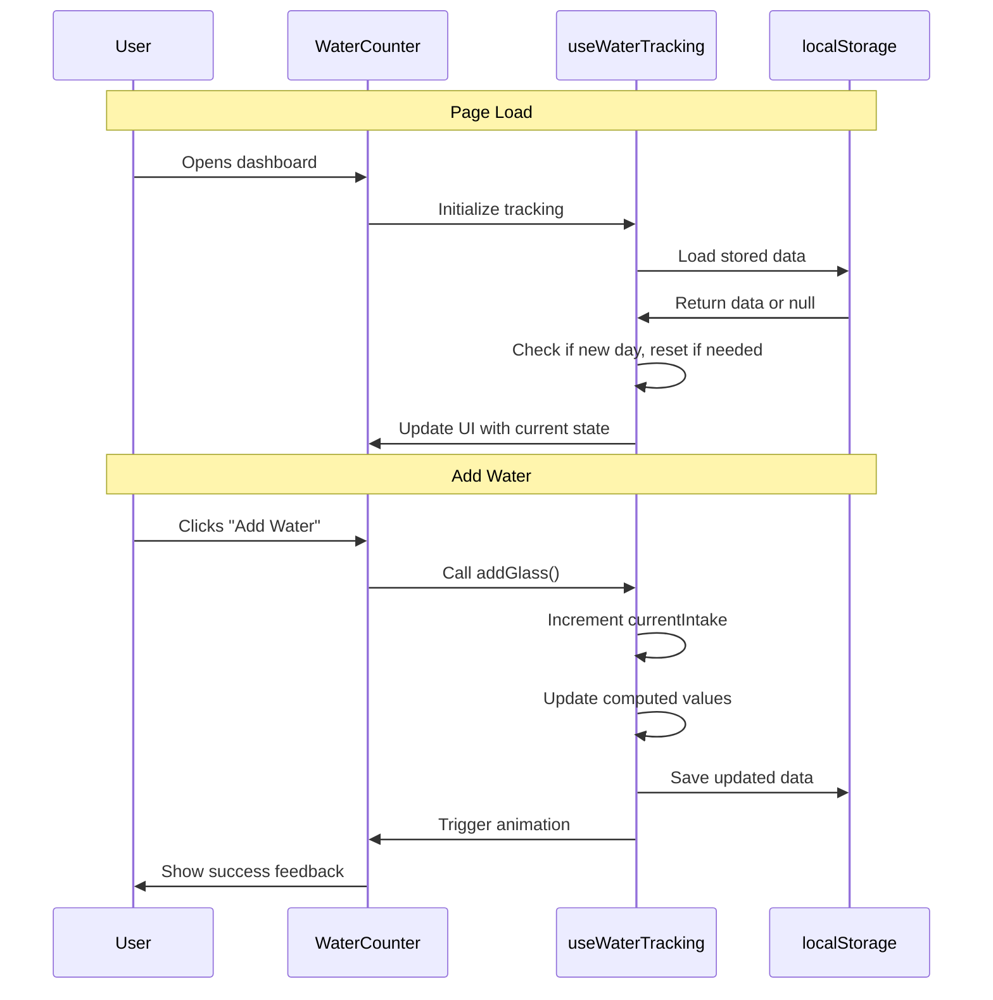

# 01 Water Intake Dashboard - Implementation Planning

## User Story

As a health-conscious user, I want to track my daily water intake with a visual counter on the dashboard, so that I can easily monitor my progress toward my daily hydration goal.

## Pre-conditions

- Fresh Next.js 16.2.0 project with TypeScript and Tailwind CSS v4
- No existing water tracking implementation
- Landing page currently shows default Next.js content
- Need to build from scratch following modern React Server Components patterns

## Design

### Visual Layout

The Water Intake Dashboard will be the primary landing page featuring:

- **Hero Section**: Welcoming header with app title and motivational tagline
- **Water Counter Card**: Central prominent card displaying:
  - Current water intake count (e.g., "5 / 8 glasses")
  - Visual progress indicator (circular progress or progress bar)
  - Large, clear numbers for easy reading
  - Add water button prominently placed
- **Progress Visualization**: 
  - Progress bar or circular progress indicator showing percentage toward goal
  - Glass icons representing each glass consumed (filled vs empty)
- **Daily Reset Indicator**: Shows when the day resets (midnight local time)

### Color and Typography

Following the Palo IT-inspired design system from the instructions:

- **Background Colors**: 
  - Primary: bg-white dark:bg-gray-900
  - Card: bg-white with shadow-lg border border-gray-200
  - Progress filled: bg-[var(--color-primary-500)] (PALO Teal #00ab9c)
  - Progress empty: bg-gray-200 dark:bg-gray-700

- **Typography**:
  - Page Title: text-4xl font-bold text-gray-900 dark:text-white
  - Counter Numbers: text-6xl font-bold text-[var(--color-primary-600)]
  - Labels: text-base text-gray-600 dark:text-gray-300
  - Button Text: text-white font-semibold

- **Component-Specific**:
  - Water Card: bg-white shadow-xl rounded-2xl p-8 border border-gray-100
  - Add Button: bg-[var(--color-primary-500)] hover:bg-[var(--color-primary-600)] text-white
  - Progress Bar: h-4 rounded-full bg-gray-200 with inner fill bg-[var(--color-primary-500)]

### Interaction Patterns

- **Add Water Button**: 
  - Hover: Background darkens slightly (150ms transition)
  - Click: Brief scale animation (scale-95) with ripple effect
  - Success: Counter animates upward with celebration effect
  - Disabled: Grayed out when goal is reached
  - Accessibility: Focus ring, keyboard navigation (Enter/Space)

- **Progress Visualization**:
  - Animate: Progress bar fills smoothly when water is added
  - Milestone feedback: Special animation at 50%, 100%
  - Color change: Progress color intensifies as goal approaches

### Measurements and Spacing

- **Container**:
  ```
  max-w-4xl mx-auto px-4 sm:px-6 lg:px-8 py-12
  ```

- **Component Spacing**:
  ```
  - Page vertical rhythm: space-y-8
  - Card padding: p-8 md:p-10
  - Button padding: px-8 py-4
  - Counter gap: gap-4
  ```

### Responsive Behavior

- **Desktop (lg: 1024px+)**:
  ```
  - Card width: max-w-2xl centered
  - Counter text: text-6xl
  - Button: full width in card
  - Glass icons: display 8 in a row
  ```

- **Tablet (md: 768px - 1023px)**:
  ```
  - Card width: max-w-xl
  - Counter text: text-5xl
  - Glass icons: 4 per row (2 rows)
  ```

- **Mobile (sm: < 768px)**:
  ```
  - Full width card with mobile padding
  - Counter text: text-4xl
  - Glass icons: 4 per row (2 rows)
  - Compact spacing
  ```

## Technical Requirements

### Component Structure

```
src/
├── app/
│   ├── page.tsx                      # Main dashboard page (Server Component)
│   ├── layout.tsx                    # Root layout with theme setup
│   └── globals.css                   # Global styles with design tokens
├── components/
│   └── water-tracker/
│       ├── WaterCounter.tsx          # Client component for water tracking UI
│       ├── AddWaterButton.tsx        # Button to add water intake
│       ├── ProgressBar.tsx           # Visual progress indicator
│       ├── GlassIcons.tsx            # Visual glass representation
│       └── useWaterTracking.ts       # Custom hook for water tracking logic
├── lib/
│   └── storage.ts                    # LocalStorage utility functions
└── types/
    └── water-tracker.ts              # TypeScript interfaces
```

### Required Components

- WaterCounter (Client Component) ⬜
- AddWaterButton (Client Component) ⬜
- ProgressBar (Client Component) ⬜
- GlassIcons (Client Component) ⬜
- useWaterTracking (Custom Hook) ⬜

### State Management Requirements

```typescript
interface WaterTrackingState {
  // Current State
  currentIntake: number;        // Number of glasses consumed today
  dailyGoal: number;            // Target glasses per day (default: 8)
  lastUpdated: string;          // ISO timestamp of last update
  
  // Computed Values
  progressPercentage: number;   // (currentIntake / dailyGoal) * 100
  isGoalReached: boolean;       // currentIntake >= dailyGoal
  remainingGlasses: number;     // dailyGoal - currentIntake
  
  // UI States
  isAnimating: boolean;         // For celebration animations
  showSuccess: boolean;         // Show success message
}

// State Actions
const actions = {
  addGlass: () => void;                    // Increment water count
  resetDaily: () => void;                  // Reset to 0 (happens at midnight)
  setGoal: (goal: number) => void;         // Update daily goal
  loadFromStorage: () => void;             // Hydrate from localStorage
  saveToStorage: () => void;               // Persist to localStorage
}
```

## Acceptance Criteria

### Layout & Content

1. Dashboard Page Structure
   ```
   - Page title: "Daily Hydration Tracker"
   - Subtitle: "Stay healthy, stay hydrated"
   - Centered water counter card
   - Responsive layout on all devices
   ```

2. Water Counter Card
   ```
   - Large counter display: "X / Y glasses"
   - Visual progress indicator
   - Add water button
   - Goal reached message when complete
   - Clean, card-based design with shadow
   ```

3. Progress Visualization
   ```
   - Progress bar OR circular progress
   - Percentage display
   - 8 glass icons (filled/empty states)
   - Color coding based on progress
   ```

### Functionality

1. Water Tracking

   - [ ] Page loads with current day's water intake from localStorage
   - [ ] Default goal is 8 glasses if not customized
   - [ ] Add button increments counter by 1 glass
   - [ ] Counter updates immediately with smooth animation
   - [ ] Progress bar/indicator updates in real-time

2. Data Persistence

   - [ ] Water intake saved to localStorage after each update
   - [ ] Data includes: count, goal, date, timestamp
   - [ ] Previous day's data is cleared at midnight (local time)
   - [ ] Page refresh maintains current day's data

3. Visual Feedback

   - [ ] Success animation when glass is added
   - [ ] Special celebration when goal is reached (100%)
   - [ ] Button disabled/styled differently when goal reached
   - [ ] Smooth transitions for all state changes

### Navigation Rules

- Dashboard is the root page (/) - landing page
- No navigation required for MVP (single page app)
- All interactions happen on the main dashboard
- Future: Settings page will be linked from this page

### Error Handling

- Handle localStorage not available (privacy mode)
  - Fallback to in-memory state
  - Show warning message to user
- Handle invalid stored data
  - Reset to default values
  - Log error for debugging
- Handle timezone edge cases
  - Use local timezone for day boundaries
  - Properly detect midnight reset

## Modified Files

```
src/
├── app/
│   ├── page.tsx ⬜                    # Replace default with dashboard
│   ├── layout.tsx ⬜                  # Update with app metadata
│   └── globals.css ⬜                 # Add design tokens
├── components/
│   └── water-tracker/
│       ├── WaterCounter.tsx ⬜
│       ├── AddWaterButton.tsx ⬜
│       ├── ProgressBar.tsx ⬜
│       ├── GlassIcons.tsx ⬜
│       └── useWaterTracking.ts ⬜
├── lib/
│   └── storage.ts ⬜
└── types/
    └── water-tracker.ts ⬜
```

## Status

⬜ NOT STARTED

1. Setup & Configuration

   - [ ] Create directory structure for components
   - [ ] Define TypeScript interfaces in types/water-tracker.ts
   - [ ] Setup design tokens in globals.css
   - [ ] Create storage utility in lib/storage.ts

2. Core Components Implementation

   - [ ] Build WaterCounter component with state management
   - [ ] Create AddWaterButton with click handling
   - [ ] Implement ProgressBar with animation
   - [ ] Create GlassIcons visualization component
   - [ ] Develop useWaterTracking custom hook

3. Page Integration

   - [ ] Update app/page.tsx with dashboard layout
   - [ ] Integrate all components
   - [ ] Add responsive styling
   - [ ] Implement accessibility features (ARIA labels, keyboard nav)

4. Testing
   - [ ] Manual testing: Add water and verify persistence
   - [ ] Test localStorage functionality
   - [ ] Test midnight reset logic (simulate date change)
   - [ ] Test responsive behavior on mobile/tablet/desktop
   - [ ] Test accessibility with keyboard navigation
   - [ ] Test dark mode support

## Dependencies

- Next.js 16.2.0 (already installed)
- React 19.2.4 (already installed)
- Tailwind CSS v4 (already installed)
- TypeScript 5 (already installed)
- No additional dependencies needed for MVP

## Related Stories

- 02 (Add Water Intake) - Builds on this dashboard
- 03 (Customize Water Goal) - Extends this with settings
- 05 (Daily Streak Tracking) - Adds streak display to dashboard

## Notes

### Technical Considerations

1. **LocalStorage Strategy**: Use a single key `water-tracker-data` with JSON structure containing all tracking data
2. **Date Handling**: Store ISO date strings, compare with current date on load to detect day changes
3. **Client Components Required**: All interactive elements must be Client Components with 'use client' directive
4. **Server Component for Page**: Main page.tsx remains Server Component, only UI components are client
5. **Animation Performance**: Use CSS transforms for animations (not position/dimensions) for 60fps

### Business Requirements

- Water tracking is the core MVP feature - prioritize over all other features
- Dashboard must be clean, simple, and motivating
- User should immediately understand how to add water
- Goal completion should feel rewarding
- Must work offline (localStorage only, no API needed for MVP)

### API Integration

Not applicable for MVP - using localStorage only. Future backend integration will:
- Sync data across devices
- Store historical data beyond localStorage limits
- Enable analytics and insights

#### Type Definitions

```typescript
// types/water-tracker.ts

interface WaterTrackingData {
  currentIntake: number;
  dailyGoal: number;
  date: string;              // ISO date string (YYYY-MM-DD)
  lastUpdated: string;       // ISO timestamp
}

interface WaterTrackerState extends WaterTrackingData {
  isGoalReached: boolean;
  progressPercentage: number;
  remainingGlasses: number;
  isAnimating: boolean;
}
```

### Mock Implementation

Not applicable - no API mocking needed for MVP (localStorage only)

### State Management Flow



### Custom Hook Implementation

```typescript
// components/water-tracker/useWaterTracking.ts

const useWaterTracking = () => {
  const [state, setState] = useState<WaterTrackerState>(() => {
    // Initialize from localStorage or defaults
    const stored = loadFromStorage();
    return stored || getDefaultState();
  });

  const addGlass = useCallback(() => {
    setState(prev => {
      const newIntake = prev.currentIntake + 1;
      const newState = {
        ...prev,
        currentIntake: newIntake,
        progressPercentage: (newIntake / prev.dailyGoal) * 100,
        isGoalReached: newIntake >= prev.dailyGoal,
        remainingGlasses: Math.max(0, prev.dailyGoal - newIntake),
        lastUpdated: new Date().toISOString(),
        isAnimating: true,
      };
      
      saveToStorage(newState);
      return newState;
    });
    
    // Reset animation after delay
    setTimeout(() => {
      setState(prev => ({ ...prev, isAnimating: false }));
    }, 500);
  }, []);

  // Check for day change on mount and periodically
  useEffect(() => {
    const checkDayChange = () => {
      const today = new Date().toISOString().split('T')[0];
      if (state.date !== today) {
        resetDaily();
      }
    };
    
    checkDayChange();
    const interval = setInterval(checkDayChange, 60000); // Check every minute
    
    return () => clearInterval(interval);
  }, [state.date]);

  const resetDaily = () => {
    const newState = getDefaultState();
    saveToStorage(newState);
    setState(newState);
  };

  return {
    ...state,
    addGlass,
    resetDaily,
  };
};
```

## Testing Requirements

### Integration Tests (Target: 80% Coverage)

1. Core Functionality Tests

```typescript
describe('Water Tracking', () => {
  it('should initialize with 0 glasses on first visit', () => {
    // Clear localStorage
    // Render component
    // Verify count is 0/8
  });

  it('should increment counter when add button is clicked', () => {
    // Render component
    // Click add button
    // Verify count increased
  });

  it('should persist data to localStorage', () => {
    // Add water
    // Check localStorage has correct data
  });

  it('should load persisted data on page refresh', () => {
    // Set localStorage data
    // Render component
    // Verify data loaded correctly
  });
});
```

2. Day Reset Tests

```typescript
describe('Daily Reset', () => {
  it('should reset counter when day changes', () => {
    // Set yesterday's data in localStorage
    // Render component
    // Verify counter reset to 0
  });

  it('should maintain data for same day', () => {
    // Set today's data with 5 glasses
    // Render component
    // Verify count still 5
  });
});
```

3. Edge Cases

```typescript
describe('Edge Cases', () => {
  it('should handle localStorage not available', () => {
    // Mock localStorage to throw error
    // Render component
    // Verify fallback to in-memory state
  });

  it('should handle corrupted localStorage data', () => {
    // Set invalid JSON in localStorage
    // Render component
    // Verify reset to defaults
  });

  it('should prevent adding water beyond reasonable limits', () => {
    // Consider max limit (e.g., 50 glasses)
  });
});
```

### Performance Tests

1. Animation Performance

```typescript
describe('Performance', () => {
  it('should maintain 60fps during animations', () => {
    // Measure frame rate during add water animation
  });

  it('should debounce rapid clicks appropriately', () => {
    // Rapidly click add button
    // Verify state updates correctly
  });
});
```

### Accessibility Tests

```typescript
describe('Accessibility', () => {
  it('should be keyboard navigable', () => {
    // Tab to button
    // Press Enter/Space
    // Verify water added
  });

  it('should have proper ARIA labels', () => {
    // Check for aria-label on button
    // Check for aria-live on counter
  });

  it('should announce updates to screen readers', () => {
    // Verify aria-live region updates
  });
});
```
